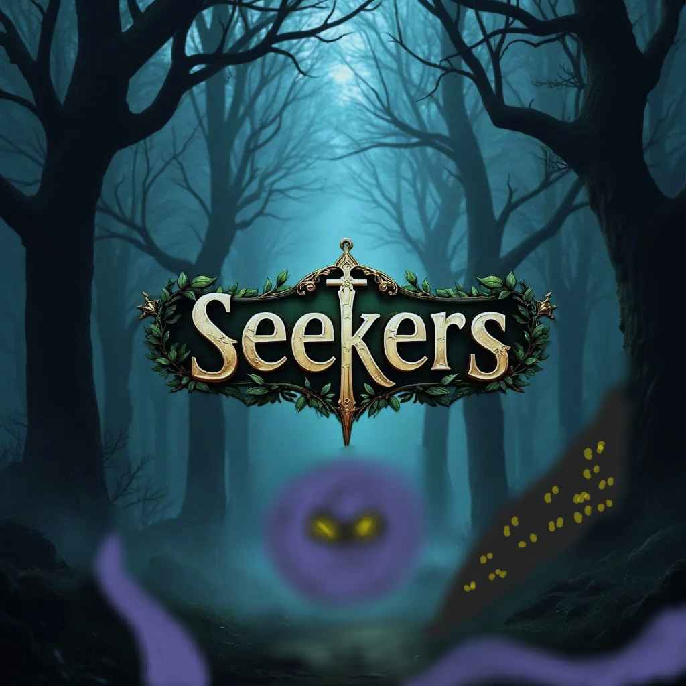

# Seekers



## Team 23: Los Pollos Hermanos Gaming

Seekers is a third person 3D action RPG that melds dungeon crawling with open-world exploration. Set in the dark fantasy world of Eldoria, players take on the role of a Seeker, striving to uncover ancient secrets and restore balance to a land shrouded in darkness.

### Key Features

- **Dynamic Combat System**: Engage in skill-based, real-time battles using a variety of weapons and abilities
- **Procedural Generation**: Explore vast, mutated landscapes that change with each playthrough
- **3D Rendering**: Full 3D perspective with dynamic camera system
- **Advanced AI**: Enemies coordinate and adapt to player strategies
- **Rich Animation System**: Fluid character animations with skeletal rigging
- **Dynamic Lighting**: Real-time lighting with Blinn-Phong shading model

### Game Controls

- **Movement**: WASD keys
  - W: Move forward
  - A: Move left
  - S: Move backward
  - D: Move right
- **Camera Rotation**: Mouse Movemement (or Q and E keys)
  - Q: Rotate camera left
  - E: Rotate camera right
- **Attack**: Left mouse button
- **Dodge**: Spacebar
- **Quit Game**: Z key
- **Aim**: Mouse movement

### Project Structure

- `src/`: Source code
  - `app/`: Core application logic (World, EntityFactory, InputManager)
  - `components/`: ECS components (AI, Combat, Physics, Render, etc.)
  - `ecs/`: Entity Component System implementation
  - `globals/`: Global variables and constants
  - `renderer/`: OpenGL rendering utilities
  - `systems/`: Game systems (Collision, Gameplay, Physics)
  - `shaders/`: GLSL shader files
  - `textures/`: Game textures and sprites
  - `utils/`: Utility functions and classes
  - `main.cpp`: Entry point of the application
- `doc/`: Documentation files
- `CMakeLists.txt`: CMake build configuration

## Milestone 2 Implementation Details

### Mandatory Requirements (80%)

#### Improved Gameplay (60%)

1. **Game AI (15%)** ✓

   Our AI system implements state and decision tree-driven responses to both user input and game states, meeting the M2 requirement for reusable AI behavior across multiple entities.

   **Core Implementation:**
   - `src/components/AIComponents.hpp`
     - Defines AI states (IDLE, PATROL, CHASE, ATTACK)
     - Manages AI properties (detection radius, patrol points)
     - Handles vision and targeting systems
   
   - `src/systems/AISystem.hpp`
     - Implements decision tree logic for state transitions
     - Controls behavior execution:
       - Patrol: Systematic area coverage with waypoints
       - Chase: Player pursuit with pathfinding
       - Attack: Combat positioning and weapon control
       - Idle: Default state with environment awareness
   
   - `src/systems/GridMapSystem.hpp`
     - Provides grid-based world representation
     - Enables efficient pathfinding and spatial awareness
   
   - `src/utils/PathFinder.hpp`
     - Smart navigation system
     - Handles obstacle avoidance
     - Used by multiple AI behaviors

   **Key Features:**
   1. Decision Tree Structure
      - Reusable across different enemy types
      - State transitions based on:
        - Distance to player
        - Line of sight
        - Health status
        - Environmental conditions

   2. Intelligent Behaviors
      - Vision-based detection system
      - Tactical positioning
      - Group coordination
      - Dynamic path recalculation

   3. Integration
      - Seamless interaction with physics system
      - Combat system integration
      - Environmental awareness
      - Resource optimization

   **Why This Meets Requirements:**
   - ✓ State-driven responses to user input
   - ✓ Decision tree architecture
   - ✓ Reusable across multiple entities
   - ✓ Complex, non-trivial behaviors
   - ✓ Integrated with core game systems

2. **Animation (15%)** ✓

   Our animation system implements a full skeletal animation pipeline with support for multiple states and smooth transitions, exceeding the M2 requirement for sprite-based animations.

   **Core Implementation:**
   - `src/renderer/AnimatedModel.hpp`
     - Manages animated 3D models
     - Handles multiple animation states
     - Controls animation playback and blending
   
   - `src/renderer/Animation.hpp`
     - Defines animation clip structure
     - Manages keyframes and timing
     - Handles animation data loading
   
   - `src/renderer/Animator.hpp`
     - Controls animation state machines
     - Manages transitions between animations
     - Handles animation blending and mixing
   
   - `src/renderer/Skeleton.hpp`
     - Implements skeletal hierarchy
     - Manages bone transformations
     - Handles pose calculations

   **Key Features:**
   1. Animation States
      - Idle, Walk, Run animations
      - Combat animations (Attack, Dodge)
      - Special animations (Death, Stagger)
      - Victory and emote animations

   2. Advanced Animation Tech
      - Skeletal rigging system
      - Smooth state transitions
      - Animation blending
      - Joint hierarchy management

   3. Performance
      - Optimized bone transformations
      - Efficient memory management
      - GPU-accelerated skinning

   **Why This Meets Requirements:**
   - ✓ Full animation system (exceeds sprite-sheet requirement)
   - ✓ Multiple animation states per character
   - ✓ Smooth transitions between states
   - ✓ Integrated with gameplay systems
   - ✓ Professional-grade animation quality

3. **Assets (10%)** ✓

   Our game features a rich collection of high-quality 3D models and textures that enable engaging, non-repetitive gameplay.

   **Core Asset Types:**
   - `src/models/`
     - Character Models:
       - Hero character with full animation set
       - Multiple enemy types (Warrior, Archer, Zombie)
       - Unique rigs and animations per character
     
     - Weapon Models:
       - Detailed sword models
       - Bow and arrow sets
       - Projectile effects
     
     - Environmental Objects:
       - Spooky trees and vegetation
       - Architectural elements
       - Decorative props

   - `src/textures/`
     - Character Textures:
       - High-resolution character skins
       - Normal maps for detail
       - Specular maps for materials
     
     - Environmental Textures:
       - Terrain textures (grass, stone, etc.)
       - Wall and floor textures
       - Skybox textures
     
     - UI Elements:
       - Health and energy bars
       - Tutorial images
       - HUD elements

   **Integration Features:**
   1. Asset Management
      - Efficient texture loading system
      - Model caching and optimization
      - Resource management

   2. Visual Consistency
      - Cohesive art style
      - Proper scale relationships
      - Consistent material properties

   3. Gameplay Integration
      - Assets tied to gameplay mechanics
      - Visual feedback for actions
      - Clear visual hierarchy

   **Why This Meets Requirements:**
   - ✓ Rich variety of game assets
   - ✓ High-quality 3D models and textures
   - ✓ Supports core gameplay mechanics
   - ✓ Enables non-repetitive gameplay
   - ✓ Professional-grade visual quality

4. **Mesh-based Collision Detection (10%)** ✓

   Our collision system implements sophisticated mesh-based detection with support for multiple collision types and precise contact resolution, meeting the M2 requirement for non-trivial mesh collisions.

   **Core Implementation:**
   - `src/systems/CollisionSystem.hpp`
     - Spatial partitioning grid for broad-phase detection
     - Detailed collision checks for multiple geometry types:
       - Circle-Circle collisions
       - Circle-Wall (mesh) collisions
       - Circle-Mesh (convex) collisions
       - Mesh-Wall collisions
     - Precise collision response and resolution
   
   - `src/components/PhysicsComponents.hpp`
     - Defines collision primitives and meshes:
       - CircleCollider: For characters and simple objects
       - WallCollider: For complex wall geometries
       - MeshCollider: For detailed weapon and projectile collisions
     - Implements collision bounds and transformations
   
   - `src/app/EntityFactory.hpp`
     - Creates mesh colliders for projectiles from 3D models
     - Generates wall colliders with proper edge detection
     - Handles collision component initialization

   **Key Features:**
   1. Advanced Collision Types
      - Non-trivial mesh shapes for walls and projectiles
      - Dynamic mesh generation from 3D models
      - Multi-stage collision detection:
        - Broad phase using spatial grid
        - Narrow phase with precise geometry checks

   2. Collision Resolution
      - Accurate penetration depth calculation
      - Normal vector computation for response
      - Proper velocity reflection and friction
      - Stable multi-contact handling

   3. Performance Optimizations
      - Spatial partitioning for efficient broad-phase
      - Optimized mesh-circle intersection tests
      - Cached collision data for static objects
      - Early-out checks for impossible collisions

   **Why This Meets Requirements:**
   - ✓ Implements non-trivial mesh shapes (beyond simple rectangles/circles)
   - ✓ Handles complex collision scenarios:
     - Projectile-wall collisions
     - Character-environment interactions
     - Weapon hit detection
   - ✓ Provides accurate collision response
   - ✓ Maintains stable physics simulation
   - ✓ Optimized for performance with spatial partitioning

5. **Help/Tutorial (5%)** ✓

   Interactive tutorial system that guides new players through core gameplay mechanics.

   **Core Implementation:**
   - `src/systems/TutorialSystem.hpp`
     - Progressive tutorial states:
       ```cpp
       enum class TUTORIAL_STATE {
           NOTHING_DONE,
           MOVEMENTS_DONE,
           AIM_DONE,
           DODGE_DONE,
           ATTACK_DONE,
           TUTORIAL_DONE
       };
       ```
     - State-based instruction display
     - Automatic progression tracking

   - `src/textures/tutorial/`
     - Clear instructional images
     - Control scheme visualizations
     - Progressive gameplay guides

   **Why This Meets Requirements:**
   - ✓ Clear user instructions
   - ✓ Interactive progression
   - ✓ Covers all core mechanics
   - ✓ Visual feedback system

6. **FPS Counter (5%)** ✓

   Dynamic frame rate display implementation in window title.

   **Core Implementation:**
   - `src/app/Application.hpp`
     ```cpp
     float delta_time = float(timer.GetTime()) - time_of_last_frame;
     m_renderer->set_title(m_window_name + " | FPS: " + 
         std::to_string(1.0f / delta_time_s));
     ```
     - Accurate frame time calculation
     - Real-time FPS updates
     - Consistent performance monitoring

   **Why This Meets Requirements:**
   - ✓ Always visible during gameplay
   - ✓ Accurate frame rate reporting
   - ✓ Real-time updates
   - ✓ Performance monitoring tool

#### Playability & Stability (10%)
- Consistent frame rate management as shown by the FPS counter
- Optimized rendering pipeline: `src/renderer/Renderer.hpp`
- Stable collision detection: `src/systems/CollisionSystem.hpp`

#### Reporting (10%)
- Test plan: `/doc/test-plan-m2.docx`
- Bug tracking: `/doc/bug-report.xlsx`
- Demo video: Submitted separately

### Creative Component (20%)

#### Graphics Features
1. **Advanced 3D Rendering**
   - Full 3D perspective camera: `src/renderer/Camera.hpp`
   - Dynamic view/projection matrices
   - Seamless 2D/3D switching

2. **Lighting System**
   - Blinn-Phong shading: `src/shaders/*BlinnPhong.fs.glsl`
   - Normal mapping for detailed surfaces
   - Dynamic shadows with proper depth handling
   - Real-time light position updates

3. **Animation System**
   - Skeletal animation: `src/renderer/Skeleton.hpp`
   - Joint hierarchy: `src/renderer/Joint.hpp`
   - Animation blending: `src/renderer/Animator.hpp`
   - Dynamic weapon attachment system

#### Technical Features
1. **Scene Graph System**
   - Model hierarchy with parent-child relationships
   - Transform management: `src/utils/Transform.hpp`
   - Equipment attachment system

2. **Procedural Generation**
   - Dynamic map generation: `src/systems/ProceduralGenerationSystem.hpp`
   - Random encounter system with enemy placement
   - Environmental variety:
     - Randomized obstacle placement
     - Dynamic room layouts
     - Varied terrain generation

3. **Advanced AI Behaviors**
   - Group coordination: `src/systems/AISystem.hpp`
     - Tactical positioning
     - Coordinated attacks
   - Context-aware animations:
     - Victory celebrations
     - Combat reactions

### Additional Features
1. **Audio System**
   - Dynamic sound effects: `src/audio/`
   - Implementation: `src/systems/AudioSystem.hpp`
   - Features:
     - Distance-based volume
     - Contextual combat sounds
     - Ambient environment audio

2. **Path Finding**
   - Smart enemy navigation: `src/utils/PathFinder.hpp`
   - Obstacle avoidance
   - Dynamic path updates

## Acknowledgments

- OpenGL and GLFW communities
- SDL2 developers
- GLM developers
- Our dedicated team members and supportive instructors

---

<p align="center">
    <strong>Embark on an Epic Journey Through the Twisted Lands of Eldoria!</strong>
</p>
